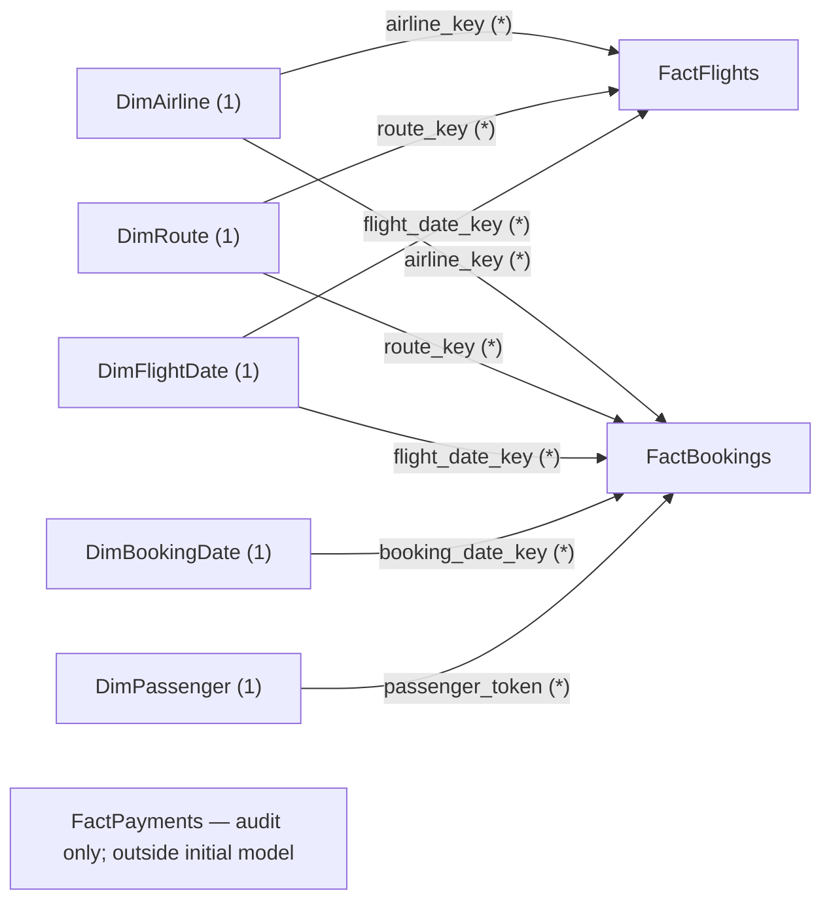

# ASG Airlines reporting model

This full-refresh model is built in `notebooks/01_data_profiling.ipynb` from the verified flight, booking, payment, and passenger reporting objects. The source workbook and persistent passenger HMAC key are preserved. No dashboard is built in this stage.

## Files and table grains

Restricted outputs are eight UTF-8 CSVs, one per table, and `data/processed/asg_airlines.db`. The database contains the same eight logical tables. SQLite monetary column names end in `_minor`; CSV amounts use their ordinary reporting names.

| Table / CSV filename | Rows verified | Grain | Power BI scope |
|---|---:|---|---|
| DimAirline / `DimAirline.csv` | 5 | One canonical airline reporting label, including UNKNOWN. | Initial model |
| DimRoute / `DimRoute.csv` | 31 | One directional source/destination pair, plus UNRESOLVED. | Initial model |
| DimFlightDate / `DimFlightDate.csv` | 4 | One real calendar date from 2026-04-17 through 2026-04-20. | Initial model |
| DimBookingDate / `DimBookingDate.csv` | 366 | One real calendar date from 2025-04-17 through 2026-04-17. | Initial model |
| DimPassenger / `DimPassenger.csv` | 1,000 | One normalized source passenger identifier, represented only by its HMAC token. | Initial model |
| FactFlights / `FactFlights.csv` | 1,002 | One accepted flight. | Initial model |
| FactBookings / `FactBookings.csv` | 1,000 | One source booking with payment coverage already aggregated. | Initial model |
| FactPayments / `FactPayments.csv` | 1,000 | One source payment record; transaction audit, not a booking-grain measure. | Audit only |

## Relationships

Use one-to-many cardinality, with a unique dimension key on the **one** side and **single-direction filtering from dimension to fact**. Do not enable bidirectional filtering.

| Dimension key | Fact key |
|---|---|
| DimAirline.airline_key | FactFlights.airline_key |
| DimAirline.airline_key | FactBookings.airline_key |
| DimRoute.route_key | FactFlights.route_key |
| DimRoute.route_key | FactBookings.route_key |
| DimFlightDate.date_key | FactFlights.flight_date_key |
| DimFlightDate.date_key | FactBookings.flight_date_key |
| DimBookingDate.date_key | FactBookings.booking_date_key |
| DimPassenger.passenger_token | FactBookings.passenger_token |

There is **no direct FactFlights–FactBookings relationship**. FactBookings.flight_id is a retained source reference, not an enforced foreign key to accepted flights. Linking the facts by this field would misrepresent unresolved references and introduce an unnecessary filter path.

FactPayments is stored for transaction audit and later extensions. Its matched_booking_id has a SQLite foreign key to FactBookings.booking_id, but this is **not an initial Power BI relationship**. Keeping source booking_id separate allows unmatched audit references to remain visible. No payment date is invented.

The separate flight-date and booking-date dimensions represent different date roles. Booking-date filters do not filter FactFlights. Passenger filters do not propagate backwards through FactBookings to the shared flight dimensions or FactFlights.

## Keys, unknown members, and attribution coverage

- Airline key **0** is UNKNOWN; remaining keys use sorted canonical names. An unknown source airline is not guessed from a flight prefix.
- Route key **0** is UNRESOLVED, with null source and destination and a literal UNRESOLVED route label. Real directional pairs receive keys in sorted source/destination order; opposite directions are different members.
- Date keys are actual calendar dates encoded as YYYYMMDD. Each date dimension is contiguous between its observed valid minimum and maximum. There are no fabricated unknown dates.
- Passenger keys are existing full-length HMAC-SHA-256 tokens, not new passenger numbers.

These assignments are deterministic for the same full-refresh input. Adding/removing sorted dimension members can shift integer keys; a production incremental warehouse needs persistent dimension-key management. HMAC tokens remain stable only while the project key and ID normalization stay the same.

The **three bookings without accepted flight matches** receive UNKNOWN airline and UNRESOLVED route, with a **null flight_date_key**. Their flight_reference_status still distinguishes ambiguous and quarantined references. Accepted bookings whose source airline is genuinely unknown also use airline key 0, but have flight_reference_status = accepted and retain their valid flight-date and route attribution.

Selecting a real flight-date range or resolved routes excludes bookings without that attribution. A booking-date filter is independent and may still include them. Keep overall booking count, flight-reference coverage, and unresolved-attribution counts visible alongside filtered measures; do not interpret a filtered count as complete source coverage.

The model enforces unique non-missing primary keys. Future key conflicts, invalid required fields, or missing enforced passenger-dimension references cause export to fail rather than dropping records, selecting a winner, or fabricating a person. Earlier standardized tables remain available for diagnosis.

## Amounts and nulls

Currency is **unspecified**. The verified total is **7,385,142.98**, representing known usable observed amounts only; it is **not established net revenue**. Settlement, refunds, taxes, fees, currency comparability, and revenue recognition have not been established. Booking cancellation does not by itself invalidate a payment or prove a refund.

Payment counts are aggregated by matched booking before joining to FactBookings. Multiple payment records for one booking are not automatically duplicates. The booking-level count columns can be zero when the extract has no matching record, but absent records are not proof of nonpayment.

There are **394 null booking subtotals**: 363 bookings with no payment record and 31 with records but no usable amounts. The other coverage groups are 45 partial and 561 complete. “Complete” means every supplied amount is usable, not that a fare was paid in full. The 78 unknown/unusable transaction amounts remain visible in quality flags and coverage metrics; no imputation replaces them with zero.

CSV amount values have a dot decimal separator and two fractional digits, with blank fields for unknown amounts. SQLite stores:
- FactBookings.`known_payment_amount_minor`
- FactPayments.`usable_amount_minor`

Both are nullable **INTEGER** values with a scale of **100**. Divide by 100 for reporting units. Scale 100 is numeric representation, not a currency assumption. This extract's exact total is **738,514,298 integer units**. Decimal validation rejects unexpected additional usable precision before formatting or integer conversion; it does not silently round. Known zero remains distinct from null.

All SQLite date/timestamp fields are ISO **TEXT**; numeric keys/counts are **INTEGER**, measurements are **REAL**, and flags are INTEGER 0/1. Nullable checks preserve null rather than turning unevaluable cases into false. CSVs contain no index column. SQLite tables are STRICT and explicitly define primary keys, foreign keys, required fields, and relevant checks.

## Initial Power BI import

Import these **seven CSVs** from the same completed refresh:
`DimAirline.csv`, `DimRoute.csv`, `DimFlightDate.csv`, `DimBookingDate.csv`, `DimPassenger.csv`, `FactFlights.csv`, and `FactBookings.csv`.

Leave `FactPayments.csv` outside the initial model. Do not import booking_payment_summary as another fact: its necessary aggregates are already in FactBookings.

In Power Query, select column types explicitly:
- Natural IDs and passenger tokens: **Text**, preserving leading zeros and tokens.
- Dimension integer keys, counts, and numeric calendar attributes: **Whole Number**.
- Date-dimension `date`: **Date**; timestamp columns: **Date/Time**.
- Duration measurements: **Decimal Number**.
- `known_payment_amount`: **Fixed Decimal Number**. If FactPayments is imported later, apply the same type to `usable_amount`. Use a locale that reads the dot decimal separator, and avoid first converting these fields through a floating-point type.
- Flags are exported as 0/1; keep Whole Number or convert explicitly to True/False, preserving blank/unknown checks.

Power BI's Fixed Decimal Number type provides fixed decimal arithmetic; its alternative “Currency” naming does not establish the dataset's currency. Do not add a currency symbol without source confirmation. See [Microsoft's data-type documentation](https://learn.microsoft.com/en-us/power-bi/connect-data/desktop-data-types#fixed-decimal-number).

Create the eight relationships listed above explicitly and review any autodetected relationships. Use the two calendar tables for their respective roles. Microsoft describes dimension-to-fact modeling in its [star-schema guidance](https://learn.microsoft.com/en-us/power-bi/guidance/star-schema).

## Privacy, ownership, and refresh operation

These outputs are **pseudonymized, not anonymous**. Passenger tokens are linkable and can support re-identification when combined with other data. Exact age is minimized to a band, but booking IDs, routes, timestamps, gender, and other analytical fields still require appropriate access controls.

All export schemas are explicit allowlists. They exclude raw passenger IDs, names, contact details, identity documents, dates of birth, exact reported age, seats, emergency contacts, raw-value copies, and free-form issue lists. Only aggregate verification and schema metadata are displayed. Token values are present only in restricted model files and memory, never in notebook previews, documentation, or logs.

The processed directory has mode 0700 and generated files mode 0600. `data/processed/` and `.secrets/` are Git-ignored, with `.secrets/` remaining the last active ignore rule required by the key loader. The 32-byte secret is neither regenerated nor exported. Evaluators explicitly initialize their own key with `.venv/bin/python -m src.pipeline --init-key --key-file .secrets/passenger_hmac.key`; existing keys are never overwritten. Their tokens differ.

Raw/intermediate data, the source workbook, notebook working session, HMAC key, and model exports all still require restricted access. Git exclusion is not access control and does not sanitize other files.

To refresh, use the CLI in [README](../README.md), or run the notebook from the beginning with the project environment. Both use the shared functions in `src/` and the explicit schemas in `src/model.py`. A complete candidate CSV/SQLite snapshot is built in a private staging directory, with foreign keys enabled and a transactional SQLite load that inserts dimensions before facts. Full value/type/null read-back validation precedes publication. Reruns replace the snapshot; they do not append rows. Production invariants are separate from the optional supplied-extract regression in `tests/check_sample.py`.

During ordinary loading exceptions, SQLite is rolled back. During publication exceptions, replaced model files are restored from temporary backups. Individual file replacement is atomic, but the complete CSV set plus database is not a single filesystem-wide transaction. The safe `run_summary.json` manifest is published last and records source/output hashes, versions, aggregate quality counts and KPI reconciliation; it never includes the secret, a secret hash, tokens, or personal records. Failed attempts write a separate report under `runs/` when possible and do not replace the last successful manifest. Do not read files during refresh; rerun and verify hashes after an abrupt process kill or power failure. Concurrent refreshes are outside this local assessment workflow. Unrelated processed files are not deleted.

## Verified snapshot

Both consecutive refreshes passed full CSV and SQLite value/null read-back comparisons, row-count and primary-key checks, foreign-key checks, calendar coverage, and schema audits. A deliberately invalid foreign-key update was rejected and rolled back.

| Check | Verified result |
|---|---:|
| FactFlights | 1,002 |
| FactBookings | 1,000 |
| FactPayments | 1,000 |
| DimPassenger | 1,000 |
| Overnight accepted flights | 122 |
| Mean duration, minutes | approximately 164.53705998 |
| CANCELLED bookings | 314 |
| UNKNOWN-status bookings | 75 |
| Usable transaction amounts | 922 |
| Known transaction amount, currency unspecified | 7,385,142.98 |
| Known matched booking amount, currency unspecified | 7,385,142.98 |
| Unresolved flight-date keys in bookings | 3 |
| Null booking payment subtotals | 394 |

The source workbook hash and existing key file metadata remained unchanged. No dashboard, publication, or GitHub push is performed.

## Field dictionary and exact export schemas

The tables below enumerate every exported column. For money, the CSV/in-memory name differs from the SQLite name by the `_minor` suffix and scale described above. All other column names are identical across CSV and SQLite. A primary key is non-null and unique. Foreign keys are as defined in the relationship section, plus the database-only payment audit link.

### DimAirline

One canonical airline reporting label, including UNKNOWN. Primary key: `airline_key`.

| CSV column | SQLite definition | Meaning |
|---|---|---|
| `airline_key` | `airline_key INTEGER NOT NULL PRIMARY KEY` | Airline dimension key; 0 is UNKNOWN. |
| `airline` | `airline TEXT NOT NULL UNIQUE` | Canonical reporting label: Air India, IndiGo, SpiceJet, Vistara, or UNKNOWN. |

### DimRoute

One directional source/destination pair, plus UNRESOLVED. Primary key: `route_key`.

| CSV column | SQLite definition | Meaning |
|---|---|---|
| `route_key` | `route_key INTEGER NOT NULL PRIMARY KEY` | Directional route dimension key; 0 is UNRESOLVED. |
| `source` | `source TEXT` | Normalized departure airport code; null on the UNRESOLVED member. |
| `destination` | `destination TEXT` | Normalized arrival airport code; null on the UNRESOLVED member. |
| `route` | `route TEXT NOT NULL UNIQUE` | Directional label source → destination, or UNRESOLVED. |

### DimFlightDate

One real calendar date from 2026-04-17 through 2026-04-20. Primary key: `date_key`.

| CSV column | SQLite definition | Meaning |
|---|---|---|
| `date_key` | `date_key INTEGER NOT NULL PRIMARY KEY` | Real calendar date encoded as YYYYMMDD; unique within this date dimension. |
| `date` | `date TEXT NOT NULL UNIQUE` | ISO calendar date, YYYY-MM-DD. No artificial unknown date. |
| `year` | `year INTEGER NOT NULL` | Calendar year. |
| `month` | `month INTEGER NOT NULL` | Calendar month number, 1–12. |
| `month_name` | `month_name TEXT NOT NULL` | English calendar month label. |
| `day` | `day INTEGER NOT NULL` | Day of month. |
| `weekday` | `weekday INTEGER NOT NULL` | ISO-style weekday number: Monday = 1 through Sunday = 7. |
| `weekday_name` | `weekday_name TEXT NOT NULL` | English weekday label. |

### DimBookingDate

One real calendar date from 2025-04-17 through 2026-04-17. Primary key: `date_key`.

| CSV column | SQLite definition | Meaning |
|---|---|---|
| `date_key` | `date_key INTEGER NOT NULL PRIMARY KEY` | Real calendar date encoded as YYYYMMDD; unique within this date dimension. |
| `date` | `date TEXT NOT NULL UNIQUE` | ISO calendar date, YYYY-MM-DD. No artificial unknown date. |
| `year` | `year INTEGER NOT NULL` | Calendar year. |
| `month` | `month INTEGER NOT NULL` | Calendar month number, 1–12. |
| `month_name` | `month_name TEXT NOT NULL` | English calendar month label. |
| `day` | `day INTEGER NOT NULL` | Day of month. |
| `weekday` | `weekday INTEGER NOT NULL` | ISO-style weekday number: Monday = 1 through Sunday = 7. |
| `weekday_name` | `weekday_name TEXT NOT NULL` | English weekday label. |

### DimPassenger

One normalized source passenger identifier, represented only by its HMAC token. Primary key: `passenger_token`.

| CSV column | SQLite definition | Meaning |
|---|---|---|
| `passenger_token` | `passenger_token TEXT NOT NULL PRIMARY KEY` | Full HMAC-SHA-256 token of the normalized source passenger ID; a pseudonymous identifier, not a verified person. |
| `age_band` | `age_band TEXT NOT NULL` | Band of the valid, agreed reported age: 0–17, 18–29, 30–44, 45–59, 60–120, or UNKNOWN. Exact age is excluded. |
| `gender` | `gender TEXT NOT NULL` | Agreed normalized source gender: MALE, FEMALE, or UNKNOWN; never inferred from personal details. |
| `source_record_count` | `source_record_count INTEGER NOT NULL CHECK (source_record_count > 0)` | Number of source passenger records represented by this identifier, including conflicting records. |
| `record_conflict` | `record_conflict INTEGER NOT NULL CHECK ("record_conflict" IN (0, 1))` | At least one original field differs across records sharing this normalized passenger ID. |
| `identity_contact_conflict` | `identity_contact_conflict INTEGER NOT NULL CHECK ("identity_contact_conflict" IN (0, 1))` | Disagreement in name, email, phone, Aadhaar, or birth-date fields; the underlying personal values are not exported. |
| `passenger_id_normalization_collision` | `passenger_id_normalization_collision INTEGER NOT NULL CHECK ("passenger_id_normalization_collision" IN (0, 1))` | Different original passenger-ID spellings collapse to one normalized key. In FactBookings this flag comes from its booking-source identifier assessment. |
| `age_conflict` | `age_conflict INTEGER NOT NULL CHECK ("age_conflict" IN (0, 1))` | Original age field values differ across passenger source records, even if normalized values agree. |
| `gender_conflict` | `gender_conflict INTEGER NOT NULL CHECK ("gender_conflict" IN (0, 1))` | Original gender labels differ across passenger source records, even if normalized labels agree. |
| `age_unresolved` | `age_unresolved INTEGER NOT NULL CHECK ("age_unresolved" IN (0, 1))` | Not every source record has the same valid reported age; reported age band is UNKNOWN. |
| `gender_unresolved` | `gender_unresolved INTEGER NOT NULL CHECK ("gender_unresolved" IN (0, 1))` | The source group does not resolve to one recognized gender; reporting gender is UNKNOWN. |

### FactFlights

One accepted flight. Primary key: `flight_id`.

| CSV column | SQLite definition | Meaning |
|---|---|---|
| `flight_id` | `flight_id TEXT NOT NULL PRIMARY KEY` | Normalized flight identifier. In FactFlights it is the accepted-flight primary key; in FactBookings it preserves the source flight reference, including ambiguous/quarantined references, and is not a foreign key to FactFlights. |
| `departure_ts` | `departure_ts TEXT NOT NULL` | Parsed departure timestamp, ISO 8601 with the source precision retained. Common-timezone assumption remains unverified. |
| `arrival_ts` | `arrival_ts TEXT NOT NULL` | Parsed arrival timestamp, ISO 8601 with the source precision retained. |
| `duration_minutes` | `duration_minutes REAL NOT NULL CHECK (duration_minutes > 0)` | Complete signed timestamp difference in minutes; accepted flights have positive values. |
| `duration_hours` | `duration_hours REAL NOT NULL CHECK (duration_hours > 0)` | duration_minutes / 60, without rounding the stored measurement. |
| `is_overnight` | `is_overnight INTEGER NOT NULL CHECK (is_overnight IN (0, 1))` | Arrival occurs on a later calendar date than departure; informational rather than an error. |
| `departure_hour` | `departure_hour INTEGER NOT NULL CHECK (departure_hour BETWEEN 0 AND 23)` | Hour of departure, 0–23, under the common-timezone assumption. |
| `airline_key` | `airline_key INTEGER NOT NULL` | Airline dimension key; 0 is UNKNOWN. |
| `route_key` | `route_key INTEGER NOT NULL` | Directional route dimension key; 0 is UNRESOLVED. |
| `flight_date_key` | `flight_date_key INTEGER NOT NULL` | Accepted departure date key. Always present in FactFlights; null in FactBookings unless its reference uniquely matches an accepted flight. |
| `timestamp_parse_issue` | `timestamp_parse_issue INTEGER NOT NULL CHECK ("timestamp_parse_issue" IN (0, 1))` | Departure or arrival timestamp is missing/unparseable. Retained as provenance; false for these accepted flights. |
| `non_positive_duration` | `non_positive_duration INTEGER NOT NULL CHECK ("non_positive_duration" IN (0, 1))` | Calculated duration is zero or negative. False for accepted flights. |
| `flight_id_conflict` | `flight_id_conflict INTEGER NOT NULL CHECK ("flight_id_conflict" IN (0, 1))` | Different source flights share the original flight ID. False for accepted flights. |
| `airline_missing` | `airline_missing INTEGER NOT NULL CHECK ("airline_missing" IN (0, 1))` | Source airline value was null. |
| `airline_blank` | `airline_blank INTEGER NOT NULL CHECK ("airline_blank" IN (0, 1))` | Non-null source airline label became empty after trimming. |
| `airline_explicit_unknown` | `airline_explicit_unknown INTEGER NOT NULL CHECK ("airline_explicit_unknown" IN (0, 1))` | Source airline explicitly said UNKNOWN, ignoring case. |
| `airline_unrecognized` | `airline_unrecognized INTEGER NOT NULL CHECK ("airline_unrecognized" IN (0, 1))` | Source airline was outside the canonical label map. |
| `flight_id_format_issue` | `flight_id_format_issue INTEGER NOT NULL CHECK ("flight_id_format_issue" IN (0, 1))` | Non-missing normalized ID fails this dataset's (AI|SJ|UK|6F)[0-9]{3} pattern; not a universal aviation rule. |
| `flight_id_normalization_conflict` | `flight_id_normalization_conflict INTEGER NOT NULL CHECK ("flight_id_normalization_conflict" IN (0, 1))` | Multiple accepted flight IDs collide after trimming and uppercasing. |
| `source_equals_destination` | `source_equals_destination INTEGER NOT NULL CHECK ("source_equals_destination" IN (0, 1))` | Normalized departure and arrival codes are identical. |
| `source_outside_allowlist` | `source_outside_allowlist INTEGER NOT NULL CHECK ("source_outside_allowlist" IN (0, 1))` | Non-missing source airport is outside the six-code dataset working list. |
| `destination_outside_allowlist` | `destination_outside_allowlist INTEGER NOT NULL CHECK ("destination_outside_allowlist" IN (0, 1))` | Non-missing destination airport is outside the six-code dataset working list. |

### FactBookings

One source booking with payment coverage already aggregated. Primary key: `booking_id`.

| CSV column | SQLite definition | Meaning |
|---|---|---|
| `booking_id` | `booking_id TEXT NOT NULL PRIMARY KEY` | Normalized source booking ID; FactBookings primary key. FactPayments retains even unresolved source references here. |
| `passenger_token` | `passenger_token TEXT` | Full HMAC-SHA-256 token of the normalized source passenger ID; a pseudonymous identifier, not a verified person. |
| `flight_id` | `flight_id TEXT` | Normalized flight identifier. In FactFlights it is the accepted-flight primary key; in FactBookings it preserves the source flight reference, including ambiguous/quarantined references, and is not a foreign key to FactFlights. |
| `booking_ts` | `booking_ts TEXT` | Separately parsed booking timestamp; null if it cannot be evaluated. |
| `status` | `status TEXT NOT NULL` | Standardized booking status: CONFIRMED, CANCELLED, PENDING, or UNKNOWN. |
| `airline_key` | `airline_key INTEGER NOT NULL` | Airline dimension key; 0 is UNKNOWN. |
| `route_key` | `route_key INTEGER NOT NULL` | Directional route dimension key; 0 is UNRESOLVED. |
| `flight_date_key` | `flight_date_key INTEGER` | Accepted departure date key. Always present in FactFlights; null in FactBookings unless its reference uniquely matches an accepted flight. |
| `booking_date_key` | `booking_date_key INTEGER` | Key of the parsed booking date; null when booking timestamp is unavailable. |
| `flight_reference_status` | `flight_reference_status TEXT NOT NULL` | missing, accepted, ambiguous, quarantined, or unmatched; preserves the reason booking flight attribution is unavailable. |
| `passenger_reference_status` | `passenger_reference_status TEXT NOT NULL` | missing, unmatched, existing-unique, or existing-nonunique. Nonunique means identity resolution is pending. |
| `booking_exact_duplicate` | `booking_exact_duplicate INTEGER NOT NULL CHECK ("booking_exact_duplicate" IN (0, 1))` | Booking belongs to an exact duplicate group in its original source table. |
| `booking_id_repeated` | `booking_id_repeated INTEGER NOT NULL CHECK ("booking_id_repeated" IN (0, 1))` | Normalized booking ID occurs more than once in the source. Such conflicts must be resolved before a primary-key model export can succeed. |
| `booking_id_normalization_collision` | `booking_id_normalization_collision INTEGER NOT NULL CHECK ("booking_id_normalization_collision" IN (0, 1))` | Different original booking-ID spellings collapse to the same normalized key. |
| `passenger_id_normalization_collision` | `passenger_id_normalization_collision INTEGER NOT NULL CHECK ("passenger_id_normalization_collision" IN (0, 1))` | Different original passenger-ID spellings collapse to one normalized key. In FactBookings this flag comes from its booking-source identifier assessment. |
| `flight_id_normalization_collision` | `flight_id_normalization_collision INTEGER NOT NULL CHECK ("flight_id_normalization_collision" IN (0, 1))` | Different original flight-reference spellings in bookings collapse to the same normalized key. |
| `status_missing` | `status_missing INTEGER NOT NULL CHECK ("status_missing" IN (0, 1))` | Source booking status was null. |
| `status_blank` | `status_blank INTEGER NOT NULL CHECK ("status_blank" IN (0, 1))` | Non-null source booking status was empty after trimming. |
| `status_unrecognized` | `status_unrecognized INTEGER NOT NULL CHECK ("status_unrecognized" IN (0, 1))` | Nonblank source booking status was outside the recognized label map. |
| `booking_date_parse_issue` | `booking_date_parse_issue INTEGER NOT NULL CHECK ("booking_date_parse_issue" IN (0, 1))` | Booking timestamp was missing, blank, or unparseable. |
| `booking_after_departure` | `booking_after_departure INTEGER CHECK (booking_after_departure IN (0, 1))` | Nullable check: 1 = after accepted departure, 0 = at/before departure, null = comparison could not be evaluated. |
| `payment_record_count` | `payment_record_count INTEGER NOT NULL CHECK (payment_record_count >= 0)` | Count of uniquely matched payment records for this booking; 0 means no record in this extract. |
| `usable_amount_count` | `usable_amount_count INTEGER NOT NULL CHECK (usable_amount_count >= 0)` | Number of matched payment records with finite, nonnegative usable amounts; zero amounts count as usable. |
| `unusable_amount_count` | `unusable_amount_count INTEGER NOT NULL CHECK (unusable_amount_count >= 0)` | payment_record_count minus usable_amount_count; unknown/review amounts remain visible. |
| `known_payment_amount` | `known_payment_amount_minor INTEGER` | Exact sum of usable matched payment amounts. Null when usable_amount_count = 0. Incomplete observed amount, not established net revenue. |
| `amount_coverage` | `amount_coverage TEXT NOT NULL` | One of: no payment record in this extract; payment records but no usable amounts; partial amount coverage; complete amount coverage. |

### FactPayments

One source payment record; transaction audit, not a booking-grain measure. Primary key: `payment_id`.

| CSV column | SQLite definition | Meaning |
|---|---|---|
| `payment_id` | `payment_id TEXT NOT NULL PRIMARY KEY` | Normalized source payment ID; unique transaction-audit primary key for this extract. |
| `booking_id` | `booking_id TEXT` | Normalized source booking ID; FactBookings primary key. FactPayments retains even unresolved source references here. |
| `matched_booking_id` | `matched_booking_id TEXT` | Nullable database-only foreign key to FactBookings: populated only for uniquely matched references. Keeps source booking_id available for unresolved-reference diagnosis. |
| `payment_method` | `payment_method TEXT NOT NULL` | Normalized CARD, UPI, NETBANKING, or UNKNOWN; no method is inferred. |
| `usable_amount` | `usable_amount_minor INTEGER` | Finite, nonnegative Decimal reporting amount. Missing, invalid, nonfinite, and negative review values remain null here. |
| `amount_missing` | `amount_missing INTEGER NOT NULL CHECK ("amount_missing" IN (0, 1))` | Source amount was null. |
| `amount_blank` | `amount_blank INTEGER NOT NULL CHECK ("amount_blank" IN (0, 1))` | Non-null source amount was blank after trimming. |
| `amount_nonnumeric` | `amount_nonnumeric INTEGER NOT NULL CHECK ("amount_nonnumeric" IN (0, 1))` | Nonblank source amount could not be parsed numerically; invalid source strings are not exported. |
| `amount_nonfinite` | `amount_nonfinite INTEGER NOT NULL CHECK ("amount_nonfinite" IN (0, 1))` | Parsed source amount was NaN or infinity. |
| `amount_negative` | `amount_negative INTEGER NOT NULL CHECK ("amount_negative" IN (0, 1))` | Source amount was negative; retained as a review flag, not inferred to be a refund or positive collection. |
| `amount_zero` | `amount_zero INTEGER NOT NULL CHECK ("amount_zero" IN (0, 1))` | Source amount was a known zero, which is usable. |
| `amount_extra_precision` | `amount_extra_precision INTEGER NOT NULL CHECK ("amount_extra_precision" IN (0, 1))` | Loaded source amount supplied more than two fractional digits. Usable amounts with such precision block this scale-100 export rather than being rounded. |
| `amount_usable` | `amount_usable INTEGER NOT NULL CHECK ("amount_usable" IN (0, 1))` | Amount quality permits inclusion in known observed totals. It is independent of booking status or payment method. |
| `payment_method_missing` | `payment_method_missing INTEGER NOT NULL CHECK ("payment_method_missing" IN (0, 1))` | Source method was null. |
| `payment_method_blank` | `payment_method_blank INTEGER NOT NULL CHECK ("payment_method_blank" IN (0, 1))` | Non-null source method was blank after trimming. |
| `payment_method_unrecognized` | `payment_method_unrecognized INTEGER NOT NULL CHECK ("payment_method_unrecognized" IN (0, 1))` | Source method was outside the expected dataset labels. |
| `payment_id_repeated` | `payment_id_repeated INTEGER NOT NULL CHECK ("payment_id_repeated" IN (0, 1))` | Normalized payment ID is repeated; source conflicts must be resolved before primary-key export. |
| `payment_exact_duplicate` | `payment_exact_duplicate INTEGER NOT NULL CHECK ("payment_exact_duplicate" IN (0, 1))` | Payment belongs to an exact source duplicate group. Repeated booking references alone are not duplicate payments. |
| `booking_reference_status` | `booking_reference_status TEXT NOT NULL` | missing, unmatched, or uniquely_matched; independent of booking's reporting status. |
| `payment_source_row` | `payment_source_row INTEGER NOT NULL UNIQUE` | Original Excel payment row number (loaded index + 2 for the header), retained for restricted audit lineage. |
